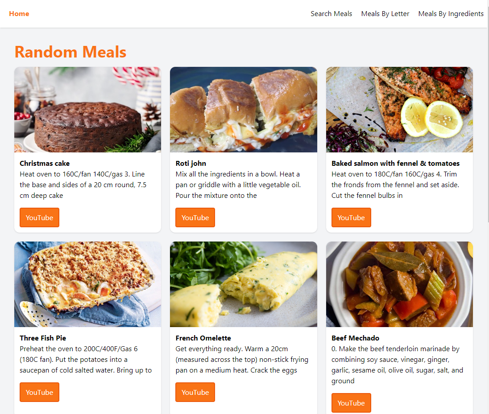
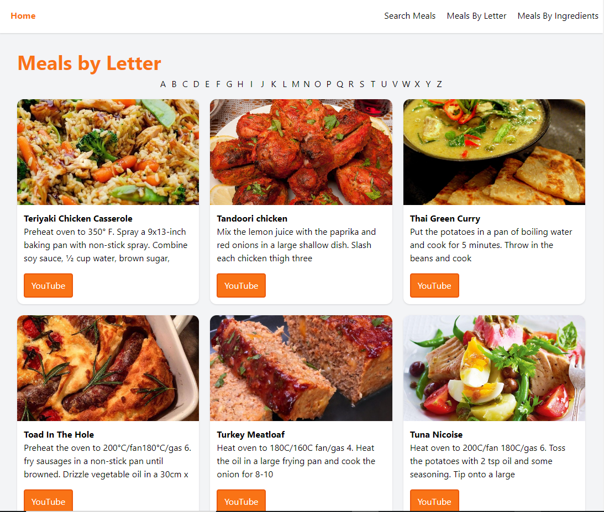
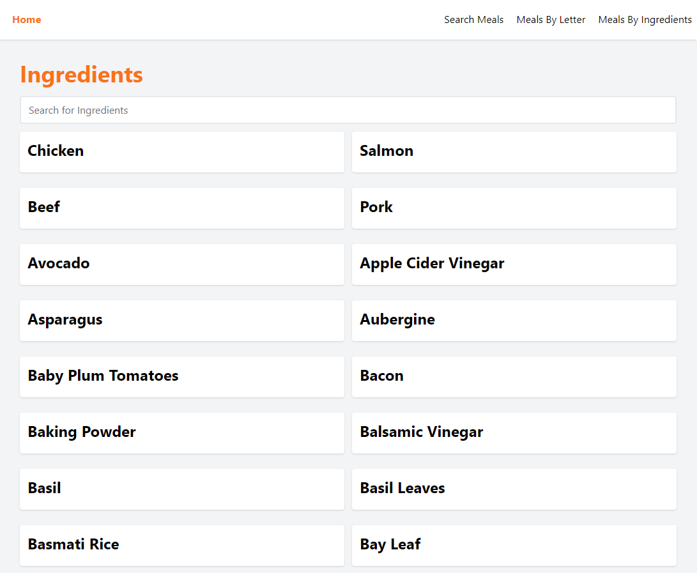

# Receipt Search app built with Vue.js
This repository is created alongside the following [YouTube Tutorial](https://youtu.be/cfiN8lCA3RM)

## Demo
[https://tc-search-meals.netlify.app](https://tc-search-meals.netlify.app/)

## Installation
1. Clone the repository
1. Run `npm install`
1. Copy `.env.example` into `.env`
1. Run `npm run dev` to start the application at http://localhost:3000

## Overview of this application ###
1. Home page

2. Seach by Letter

3. Meals by Ingredients

## API library for building this application
https://www.themealdb.com/api.php